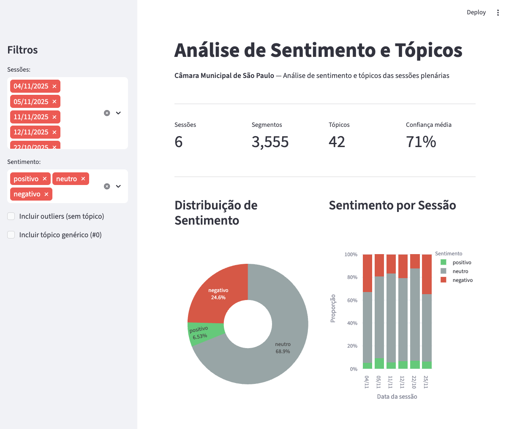
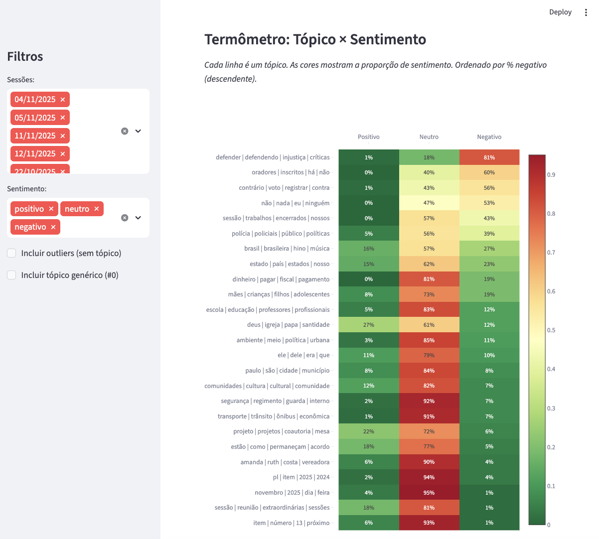
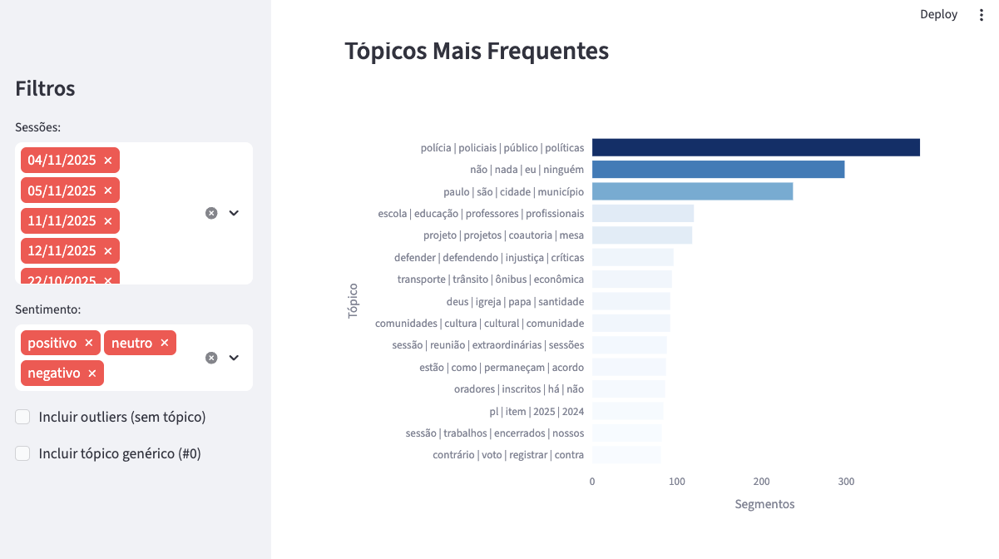
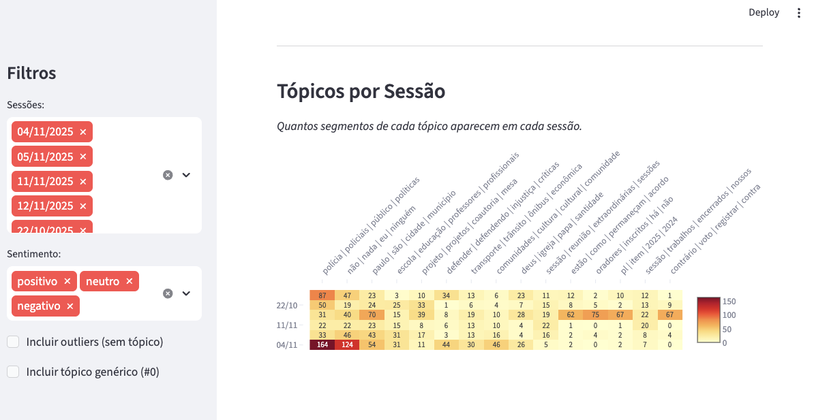
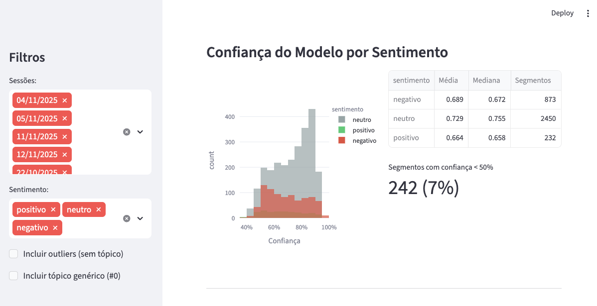
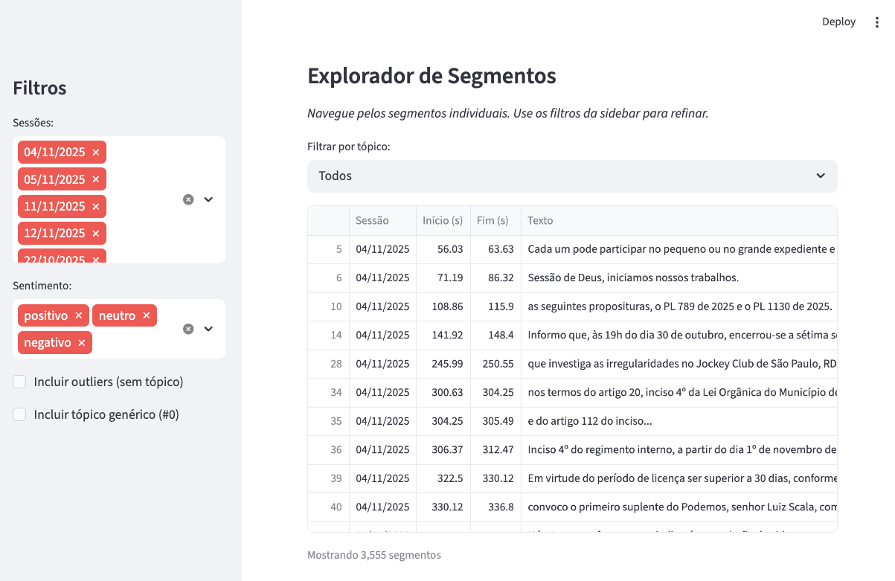
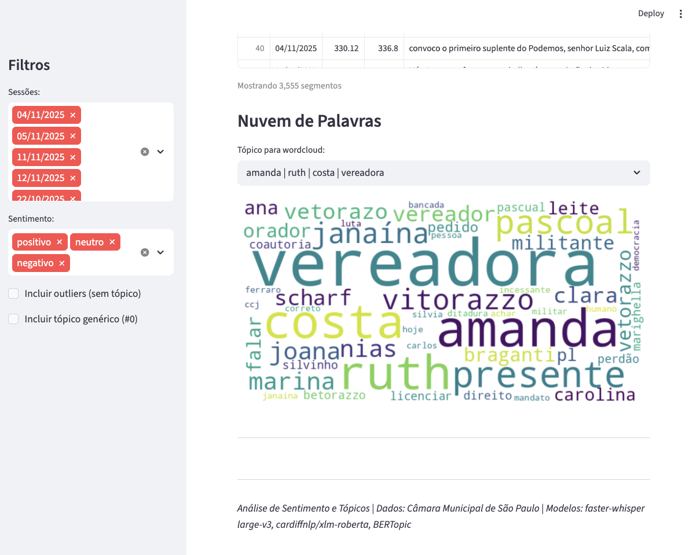

# Análise de Sentimento em Discursos Legislativos

Pipeline de análise automatizada de sentimento e tópicos em sessões plenárias da Câmara Municipal de São Paulo, utilizando técnicas de Processamento de Linguagem Natural (NLP - *Natural Language Processing*) e Aprendizado de Máquina.


[](https://github.com/cintia-shinoda/legislative-nlp-pipeline) [](https://github.com/cintia-shinoda/legislative-nlp-pipeline/stargazers/)


---

## Arquitetura

```bash
legislative-nlp-pipeline
├── data/
│   ├── output/
│   ├── processed/
│   ├── raw/
│   └── catalogo.duckdb
│
├── docs/
│   └── fontes.md
│
├── notebooks/
│
├── src/
│   ├── catalog.py
│   ├── dashboard.py
│   ├── download_audio.py
│   ├── preprocess.py
│   ├── sentiment.py
│   ├── test_pipeline
│   ├── topics.py
│   └── transcribe.py
│
├── .gitignore
├── README.md
└── requirements.txt
```

---

## Stack Tecnológico
- **Linguagem de Programação**: Python
- **Frameworks e Bibliotecas**: yt-dlp,Faster Whisper, spaCy, Pandas, Plotly, Transformers, tiktoken, Streamlit, WordCloud
- **Banco de Dados**: DuckDB

---

## Pipeline
```bash
┌─────────────┐    ┌──────────────┐    ┌──────────────┐    ┌──────────────┐
│   yt-dlp    │───▶│faster-whisper│───▶│   spaCy      │───▶│  BERTimbau   │
│  (download) │    │ (transcrição)│    │  (limpeza)   │    │ (sentimento) │
│             │    │              │    │              │    │              │
│ URL → .wav  │    │ .wav → texto │    │ texto bruto  │    │ texto limpo  │
│             │    │              │    │  → limpo     │    │  → score     │
└─────────────┘    └──────────────┘    └──────────────┘    └──────────────┘
                                                                  │
                                            ┌─────────────────────┘
                                            ▼
                                     ┌──────────────┐    ┌──────────────┐
                                     │  BERTopic    │───▶│  Streamlit   │
                                     │  (tópicos)   │    │ (dashboard)  │
                                     │              │    │              │
                                     │ textos →     │    │ dados →      │
                                     │  clusters    │    │  gráficos    │
                                     └──────────────┘    └──────────────┘
```

---

## Resultados do MVP

 







---

## Como executar o projeto
1. Clone o repositório:
```bash
git clone https://github.com/cintia-shinoda/legislative-nlp-pipeline.git
```

2. Entre na pasta do projeto:
```bash
cd legislative-nlp-pipeline
```

3. Instale as dependências:
```bash
pip install -r requirements.txt
```